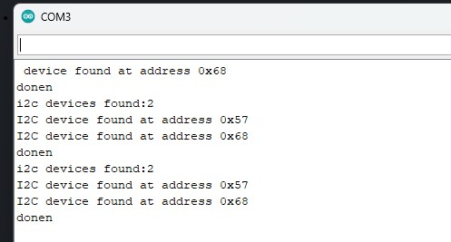

---
title: 'I2C_Scan'
disqus: hackmd
---
## 清單

[TOC]
## 說明
* This is an ESP32 program used to scan the I2C pins of a module to ensure that the module you purchased is not faulty and to provide information about the locations of its registers. (It can connect to more than one module.)
 
* 這是一個ESP32程式用來掃描模組的i2c腳位，好確認你買的模組有沒有壞掉，並告訴你他的registor位置。(可連接1個以上的模組)。

## 接線
GND:GND
模組SCL:->SCL
模組SDA:->SDA
VCC:5V or 3V

## 成果:

